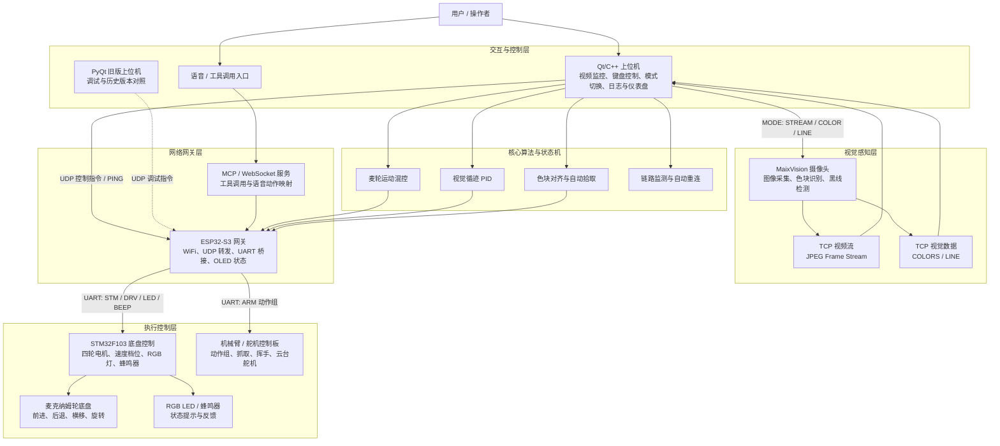

# 智能车系统功能架构图

## 功能分层说明

| 层级 | 主要模块 | 职责 |
|---|---|---|
| 交互与控制层 | Qt/C++ 上位机、PyQt 旧版上位机、语音/工具调用入口 | 人机交互、视频显示、模式切换、键盘控制、日志和状态展示 |
| 视觉感知层 | MaixVision、TCP 视频流、TCP 视觉数据 | 采集图像、输出视频帧、识别色块、检测黑线 |
| 网络网关层 | ESP32-S3、MCP/WebSocket 服务 | WiFi 接入、UDP 指令转发、串口桥接、工具调用映射 |
| 执行控制层 | STM32F103、机械臂控制板、麦克纳姆轮底盘、RGB LED | 执行运动、灯光、蜂鸣器和机械臂动作 |
| 算法与状态机 | 麦轮混控、循迹 PID、色块对齐、链路监测 | 负责运动决策、视觉闭环和通信稳定性 |

## 关键数据流

1. 用户通过 Qt 上位机输入控制命令。
2. Qt 上位机通过 UDP 将底盘、灯光、机械臂和模式指令发送到 ESP32-S3。
3. ESP32-S3 通过 UART 将底盘命令转发给 STM32，将机械臂动作组转发给舵机控制板。
4. MaixVision 将视频帧和视觉识别结果通过 TCP 返回 Qt 上位机。
5. Qt 上位机基于视觉数据执行循迹 PID、色块对齐和自动拾取状态机。
6. MCP/WebSocket 服务可将语音或工具调用转换为 ESP32-S3 可执行的控制动作。
